# Fraud Shield — Kubernetes Deployment

Отчёт по лабораторной работе №4.

## О проекте

Fraud Shield — система детекции мошеннических транзакций. Состоит из Business API (FastAPI), ML-сервиса предсказаний (PyTorch + CatBoost), PostgreSQL, RabbitMQ и MinIO для хранения моделей. 

Этот проект был использован на JMLC для поступления в AI Talent Hub. Репозиторий проекта: https://github.com/hellsys/FraudShield

## Что сделано

По требованиям нужно было развернуть минимум 2 Deployment с init-контейнерами, volumes, ConfigMap/Secret, Service и пробами. В итоге получилось 5 Deployment'ов — postgres, rabbitmq, minio, business и prediction.

Кастомные образы собраны для business, prediction и data-loader (job для загрузки тестовых данных).

## Ход работы

### 1. Базовая инфраструктура

Сначала поднимаем namespace, конфиги и MinIO:

```bash
kubectl apply -f kube/namespace.yaml
kubectl apply -f kube/configmap.yaml
kubectl apply -f kube/secret.yaml
kubectl apply -f kube/minio.yaml
kubectl wait -n fraud-shield --for=condition=ready pod -l app=minio --timeout=120s
```

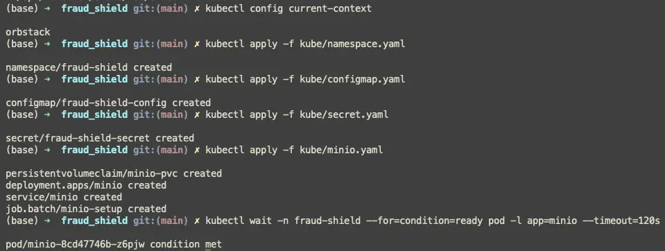

MinIO поднялся:

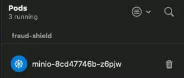

### 2. Загрузка моделей

Загружаем необходимые артефакты в MinIO через WebUI

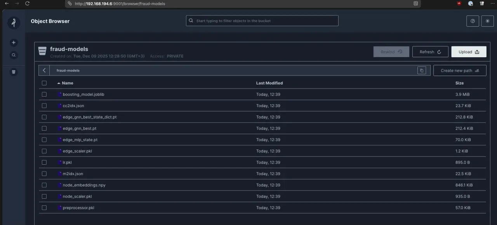

### 3. PostgreSQL и RabbitMQ

```bash
kubectl apply -f kube/postgres.yaml
kubectl apply -f kube/rabbitmq.yaml
kubectl wait -n fraud-shield --for=condition=ready pod -l app=postgres --timeout=120s
kubectl wait -n fraud-shield --for=condition=ready pod -l app=rabbitmq --timeout=120s
```

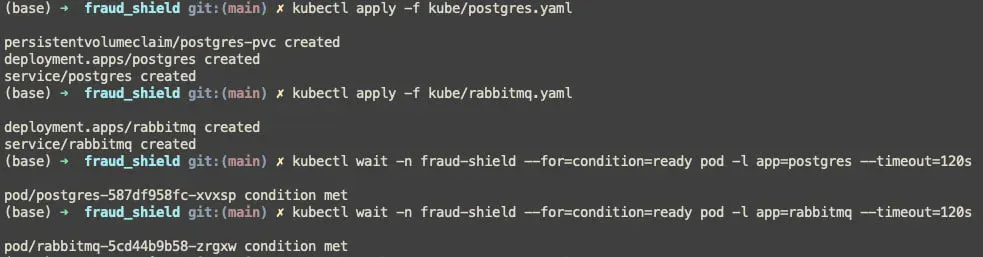

### 4. Сборка образов

```bash
docker build -t fraud-shield-business:latest ./business
docker build -t fraud-shield-prediction:latest ./prediction
docker build -t fraud-shield-init-loader:latest ./kube/init-loader
```

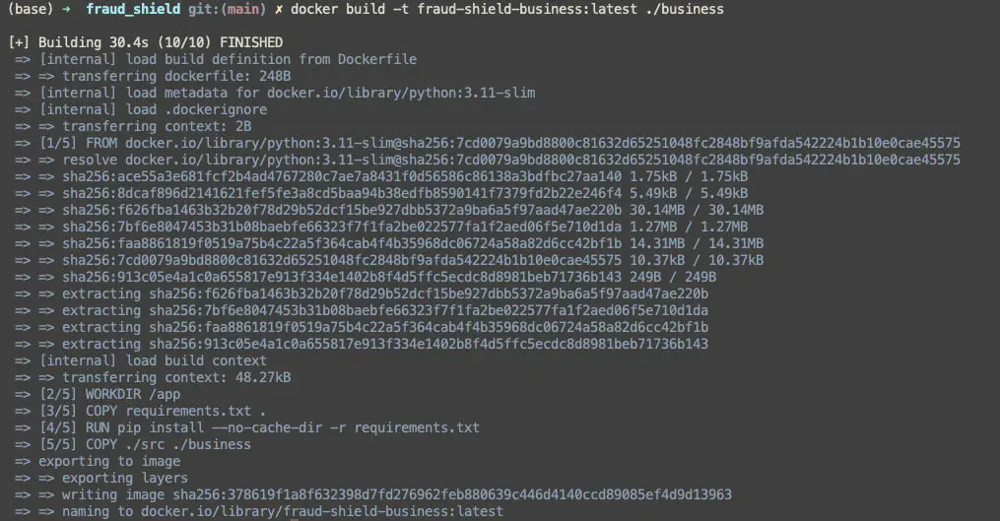

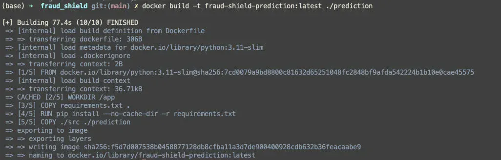

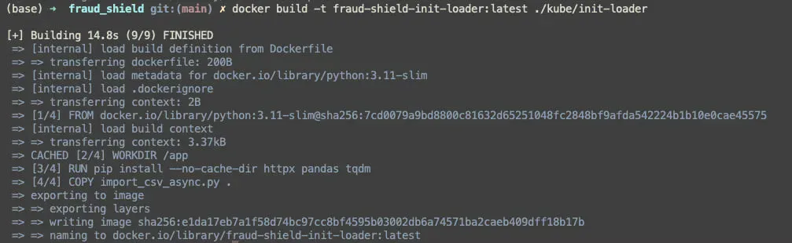

### 5. Деплой приложений

```bash
kubectl apply -f kube/business.yaml
kubectl apply -f kube/prediction.yaml
```

Business ждёт postgres и rabbitmq через init-контейнеры, prediction ждёт rabbitmq и minio.

### 6. Загрузка данных в приложение

```bash
kubectl apply -f kube/data-loader-job.yaml
```

Изначально цель этого шага была создать историю транзакций, чтобы графовая модель работала лучше. В рамках лабораторной работы он был выполнен сугубо в учебных целях (будет хоть, что в приложении показать)

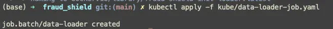

### 7. Проверка

На скриншоте видно запущенное приложение с заполненной историей транзакций. Web интерфейс запускался из терминала и использовал бэкенд, развернутый в Kubernetes.

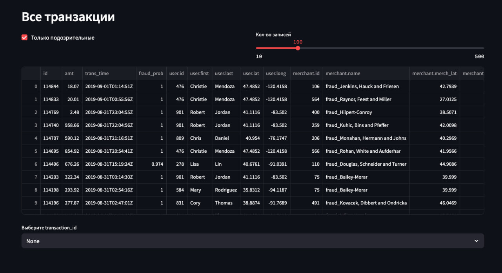

Перечень запущенных подов и логи `business` пода, где видно, что прошел healthcheck

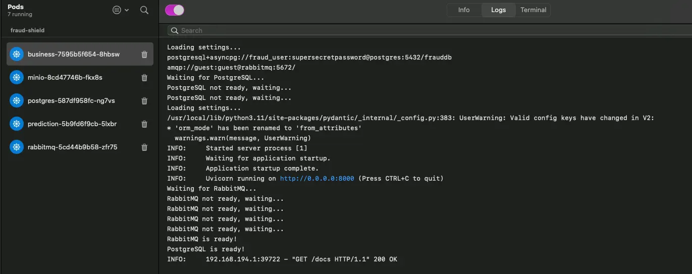

Перечень запущенных сервисов:

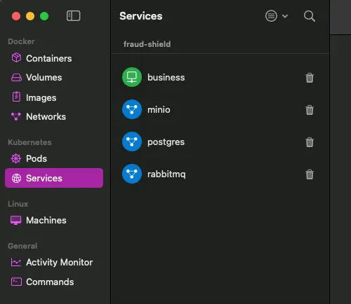

