# Установка `minikube`

`cubectl` у меня уже был установлен


Установка minikube

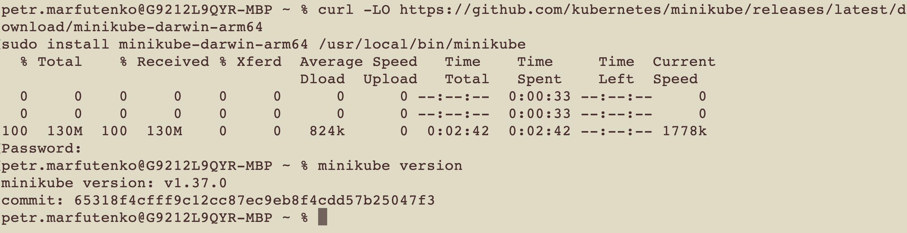

Запуск minikube

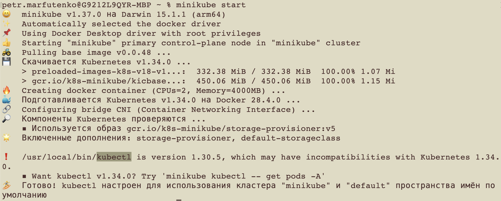

Проверка работы minikube
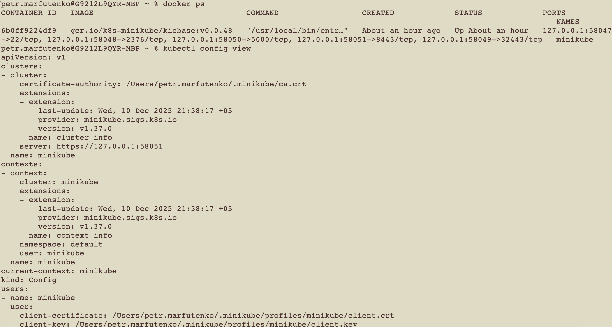

# Создание объектов через CLI
Прогоним манифесты
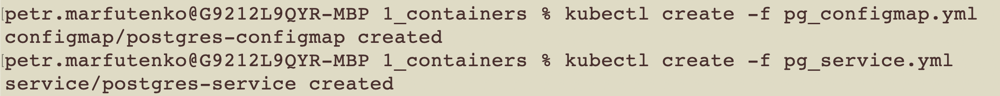
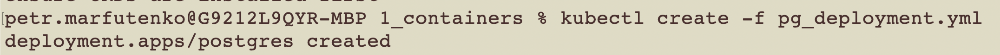

Похоже, что все создалось
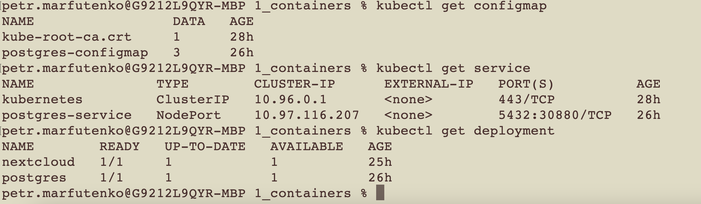

После создания nextcloud.yml пришлось подождать 2(!) часа, чтобы запустился под
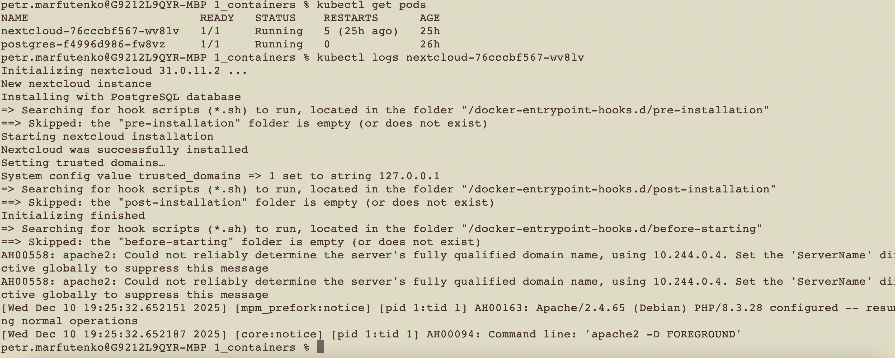

# Подключение извне
## Настроим порт форвардинг
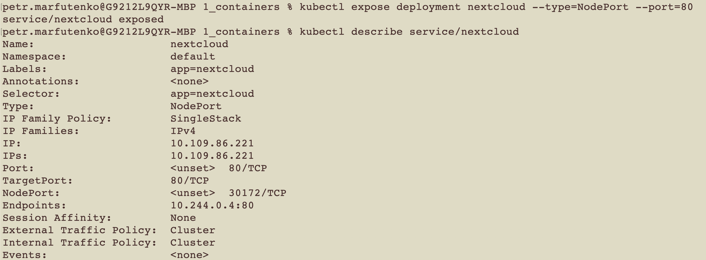

Откроем сам сервис
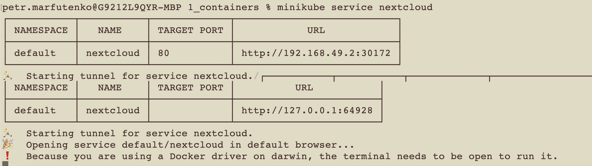

## Вопрос
```
 Вопрос: важен ли порядок выполнения этих манифестов? Почему?
```

По идее minikube не будет как-то сильно жаловаться. Если запустить сначал деплоймент, то под просто будет висеть в ошибке, до тех пор, пока не появится файл конфигмапы и сервис.

Давайте проверим. Сначала удалим все файлы. Под постгреса отключился.
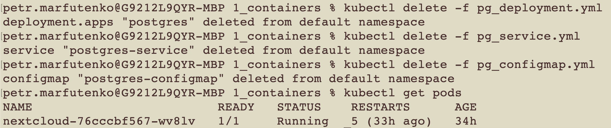

Далее добавим файлы в обратном порядке. Сначала под висел в ошибке, потом поднялся, когда добавились, все необходимые файлы
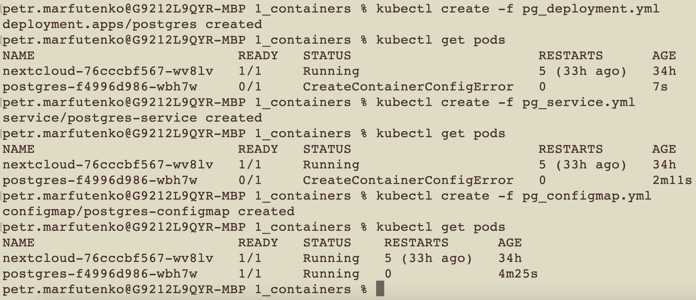

Nextcloud отказался запускаться в браузере и я перезагрузил его deployment, после чего все заработало.

Перезагружал комадой
```
kubectl rollout restart deployment nextcloud
```
## Запуск dashboard
Одной командой стартанем dashboard
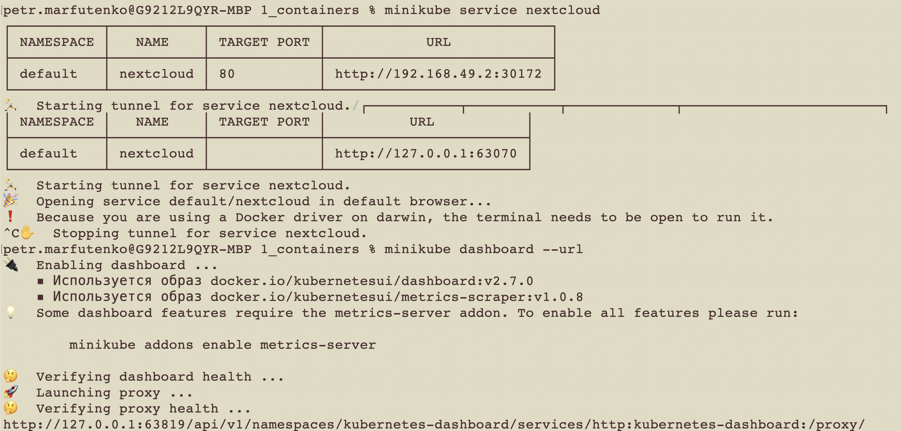


## Вопрос
```
Вопрос: что (и почему) произойдет, если отскейлить
количество реплик postgres-deployment в 0, затем обратно в 1,
после чего попробовать снова зайти на Nextcloud?
```

Если немного подождать, пока поднимется постгрес, то по идее все будет нормально.

Однако после обновлени реплик
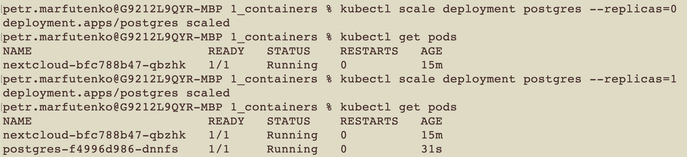
Nexcload стал падать с ошибкой

```
Internal Server Error

The server encountered an internal error and was unable to complete your request.
Please contact the server administrator if this error reappears multiple times, please include the technical details below in your report.
More details can be found in the server log.
```

Так что рестартнем его деплоймент

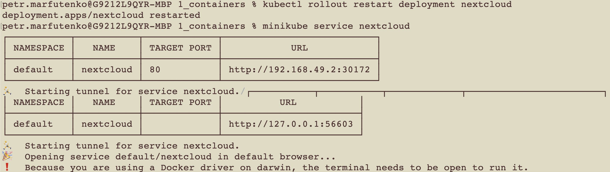

После чего все заработало

# Задания
Создадим файлик [pg_secrets.yml](pg_secrets.yml)

Перенесем сереты туда и поправим [pg_configmap.yml](pg_configmap.yml) и [pg_deployment.yml](pg_deployment.yml)

Далее создадим [nextcloud_configmap.yml](nextcloud_configmap.yml), после чего добавим пробы в [pg_deployment.yml](pg_deployment.yml).

После чего перезапустим сборки

```
kubectl rollout restart deployment nextcloud 
kubectl rollout restart deployment postgres 
```

И все готово
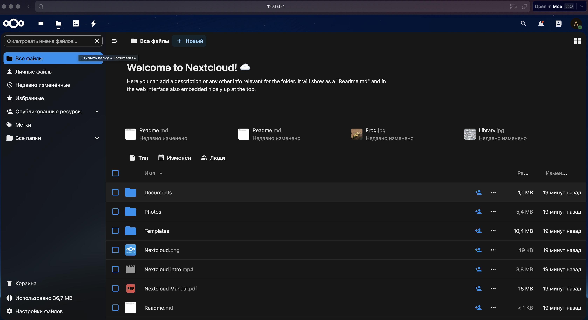